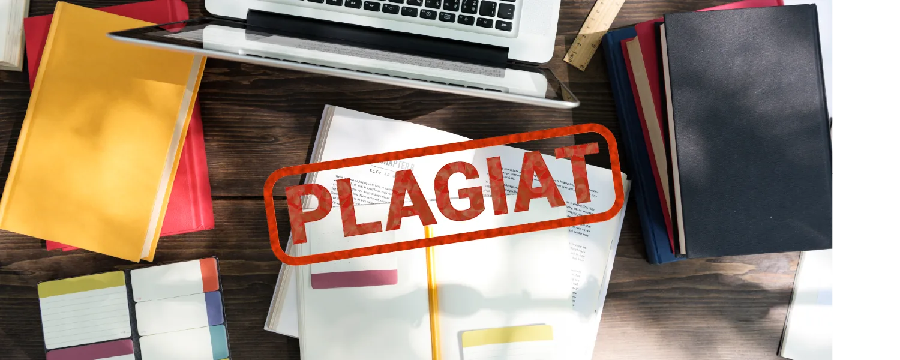

# Le plagiat

{ .banner }

## Objectifs

- Savoir ce qu'est le plagiat
- Connaître les risques et les sanctions
- Prendre les bons réflexes pour l'éviter

## Support

  
Support en ligne indisponible. Lis l'essentiel plus bas.

  <iframe src="https://docs.google.com/presentation/d/1_NmWTgMufdgwCj6uaNnK7B_wcFIQN7Lm0uXsQaA9nZM/embed" allowfullscreen loading="lazy"></iframe>

[:material-fullscreen: Plein écran](https://docs.google.com/presentation/d/1_NmWTgMufdgwCj6uaNnK7B_wcFIQN7Lm0uXsQaA9nZM/present){ .md-button target=_blank }

## L'essentiel à retenir

### Définition

> « Acte de quelqu'un qui, dans le domaine artistique ou littéraire, donne pour sien ce qu'il a pris à l'œuvre d'un autre. »
> [Larousse](https://www.larousse.fr/dictionnaires/francais/plagiat/61301)

Exemples ([UQAM](http://www.bibliotheques.uqam.ca/plagiat)) : copier un passage sans guillemets ni source, insérer images ou données sans provenance, traduire un texte sans le citer, réutiliser un travail d'un autre cours sans accord.

### Les causes

- **Ignorance** : « Ah bon, c'est mal de copier ? »
- **Mauvaise organisation** : « Je dois avoir fini dans 3 h. »
- **Fumisterie** : « Je pompe, comme ça on croit que j'ai bossé. »
- **Difficulté** : « Chercher c'est dur, et ça a déjà été fait. »

### Les sanctions

- Passage devant la **commission disciplinaire** de l'université.
- Sanction du **zéro** jusqu'à l'**interdiction d'examens** ou l'**exclusion** de quelques mois à plusieurs années.
- Le plagiat est un **délit** (Code de la propriété intellectuelle, art. L112-1 et L122-4) : dommages et intérêts, jusqu'à **2 ans de prison et 150 000 € d'amende**.

### À ne pas faire

- ❌ Acheter un travail ou rendre celui d'un autre, même avec son accord.
- ❌ Copier-coller sans guillemets ni référence.
- ❌ Réutiliser son ancien travail sans l'accord de l'enseignant.
- ❌ Résumer l'idée d'un auteur sans la lui attribuer.
- ❌ Utiliser cartes, photos, vidéos, musiques sans citer la provenance.

### Les bons réflexes

1. Citer ses sources systématiquement.
2. Noter la provenance des infos au fur et à mesure.
3. Ne pas travailler à la dernière minute.
4. En équipe, s'associer avec des personnes fiables.

!!! tip "Images libres de droits"
    [Creative Commons](https://creativecommons.org/) facilite la diffusion et le partage des œuvres.

## Exercice

??? question "Plagiat ou pas ?"
    Pour chaque cas, réponds oui ou non.

    1. Tu reformules l'idée d'un auteur avec tes mots, sans le citer.
    2. Tu copies une phrase entre guillemets avec la référence.
    3. Tu rends ton dossier de l'an dernier pour un autre cours, sans prévenir.
    4. Tu mets une photo trouvée sur Google sans source.

    ??? success "Réponses"
        1. Oui. 2. Non. 3. Oui. 4. Oui.
