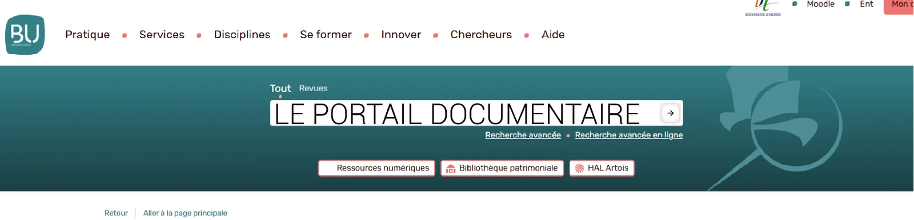

# Le portail documentaire

{ .banner }

## Objectifs

- Connaître les outils de la recherche : la bibliothèque et le portail documentaire
- Mener sa recherche dans le catalogue
- Accéder aux documents, sur place ou ailleurs

## Support

  
Support en ligne indisponible. Lis l'essentiel plus bas.

  <iframe src="https://docs.google.com/presentation/d/1v0_BLNBJxpbTP5zqETqe6cXJVWkIqd2rL5q2jlhiRuc/embed" allowfullscreen loading="lazy"></iframe>

[:material-fullscreen: Plein écran](https://docs.google.com/presentation/d/1v0_BLNBJxpbTP5zqETqe6cXJVWkIqd2rL5q2jlhiRuc/present){ .md-button target=_blank }

## L'essentiel à retenir

### Deux outils complémentaires

| Outil | Points forts |
|---|---|
| La bibliothèque | Proche, gratuite, facile d'accès |
| Le portail documentaire | Plus exhaustif, ouvre l'accès aux ressources numériques, donne un accès gratuit à des données payantes |

### Chercher dans le catalogue

1. **Recherche simple** : rapide, sur le modèle de Google. Utile pour voir les ressources sur un thème.
2. **Recherche avancée** : filtre par auteur, titre, etc. Pour gagner du temps sur une recherche ciblée.
3. **Une logique exportable** : les grands moteurs de recherche fonctionnent de la même façon.

### Les bases de données

Des outils de recherche avancée, chacun spécialisé (articles, thèses...). Ils explorent le web profond.

- **Europresse** : articles en texte intégral d'une centaine de titres de presse généraliste.
- **Techniques de l'ingénieur** : articles scientifiques en sciences appliquées et sciences dures, classés par thème, texte intégral.

!!! warning "Ressources numériques"
    Pense à être identifié pour y accéder.

### Trouver le document

- Rangement thématique : **l'indexation Dewey**
- Signalétique en tiroir
- Chaque livre a sa **cote**

### Emprunter en dehors de la BU

- **La navette** entre les sites de l'Université d'Artois : Béthune, Douai, Lens, Arras, Liévin.
- **Le Prêt Entre Bibliothèques (PEB)** et le **Sudoc** pour les universités de la région et hors région.

## Exercice

??? question "1. Simple ou avancée ?"
    Tu cherches tous les livres d'un auteur précis. Quelle recherche utilises-tu ?

    ??? success "Réponse"
        La recherche avancée, avec le filtre auteur.

??? question "2. Le bon outil"
    Tu veux lire un article du Monde paru le mois dernier. Où cherches-tu ?

    ??? success "Réponse"
        Europresse, via le portail documentaire. Pense à être identifié.

??? question "3. Livre absent"
    Le livre est à la BU d'Arras et tu es à Béthune. Quelle solution ?

    ??? success "Réponse"
        La navette entre les sites de l'Université d'Artois.
