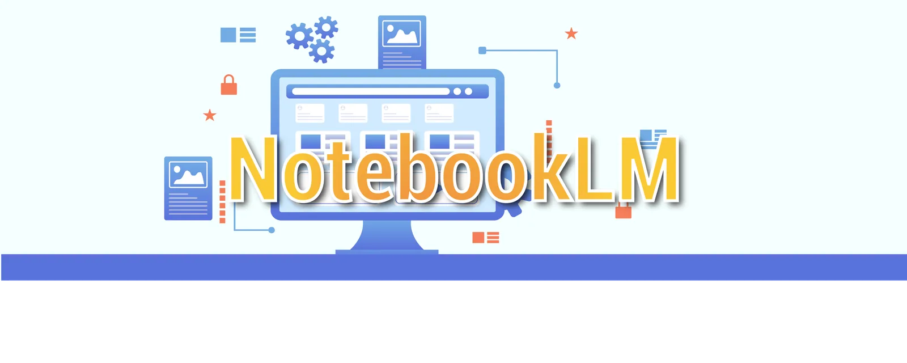

# NotebookLM

{ .banner }

## Objectifs

- Comprendre ce qui distingue NotebookLM d'une IA classique
- Connaître ses fonctionnalités et ses limites
- Savoir quand l'utiliser

## Support

  
Support en ligne indisponible. Lis l'essentiel plus bas.

  <iframe src="https://notebooklm-rurnou8.gamma.site/" allowfullscreen loading="lazy"></iframe>

[:material-fullscreen: Plein écran](https://notebooklm-rurnou8.gamma.site/){ .md-button target=_blank }

## L'essentiel à retenir

### C'est quoi ?

Un assistant de recherche de Google, basé sur Gemini. Il s'appuie **uniquement sur les sources que tu importes** (PDF, Docs, Slides, web, YouTube, audio). Résultat : beaucoup moins d'hallucinations.

### Fonctionnalités

- Analyse jusqu'à 50 sources par projet en version gratuite.
- Résumés, guides d'étude, glossaires, FAQ, timelines, cartes mentales.
- Podcast de synthèse, avec possibilité d'intervenir à la voix.
- Vidéos explicatives (slides + narration) dans 80 langues.
- **Citations** : chaque réponse renvoie au passage précis de tes documents.
- Tes données ne servent pas à entraîner d'autres IA. Attention, elles sont hébergées hors de nos frontières.

### Gratuit ou payant

| Version | Sources | Taille max | Prix |
|---|---|---|---|
| Gratuite | 50 | 200 Mo / doc | 0 € |
| Plus | 300 | 200 Mo / doc | 21,99 €/mois (Google One AI Premium) |

### NotebookLM ou ChatGPT ?

| | NotebookLM | ChatGPT |
|---|---|---|
| Connaissances | Tes documents uniquement | Savoir général + web |
| Citations | Systématiques | Pas toujours |
| Créativité | Limitée, centrée synthèse | Excellente |
| Usage idéal | Synthèse d'un corpus, révisions | Rédaction, idées, code |

Les deux se complètent.

### Limites

- La qualité dépend de tes sources : choisis-les bien.
- Les vidéos restent simples, plus proches d'un PowerPoint.
- Pas fiable à 100 % : vérifie.

## Exercice

??? question "Teste-le sur ton cours"
    Importe 2 ou 3 documents d'un même cours dans NotebookLM. Génère un guide d'étude, puis clique sur une citation pour vérifier qu'elle renvoie au bon passage.
