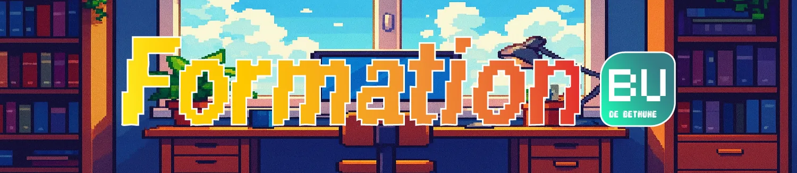
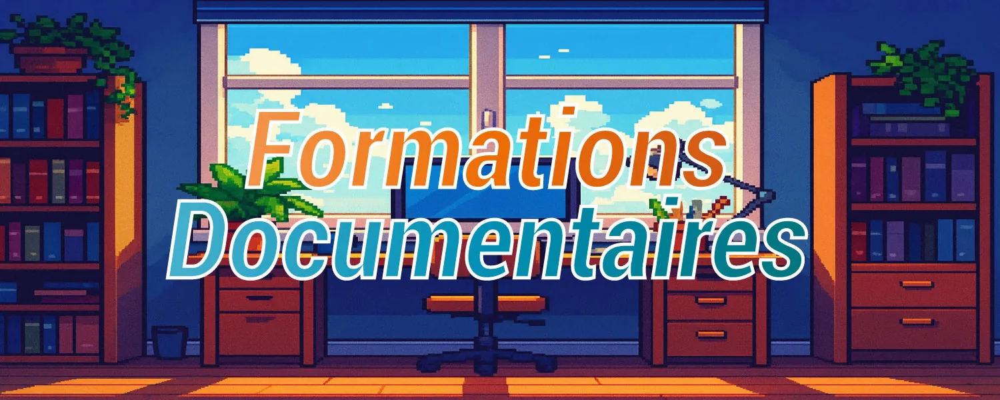
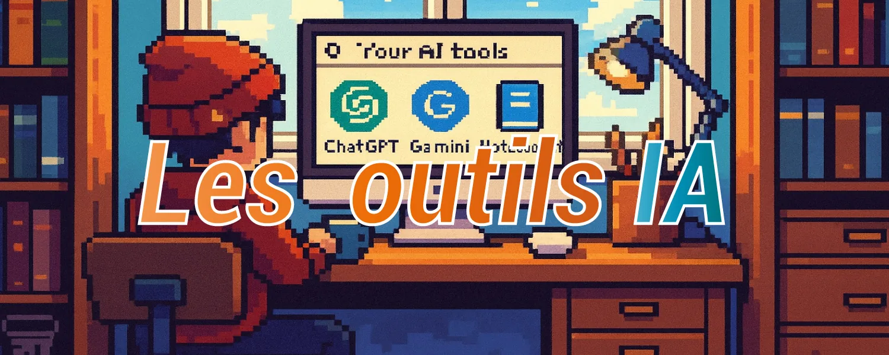
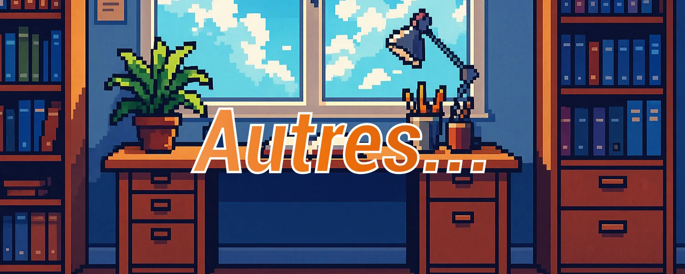

{ .banner }

# Bienvenue !

Tous les supports au même endroit, en ligne ou depuis la clé USB.

### 📚 Formations doc
- [Le portail documentaire](doc/portail.md)
- [Vérifier ses sources](doc/verifier-sources.md)
- [Le plagiat](doc/plagiat.md)
- [Zotero](doc/zotero.md)

### 🧠 Outils IA
- [Les IAG](ia/iag.md)
- [Les LLM](ia/llm.md)
- [Prompt engineering](ia/prompt.md)
- [NotebookLM](ia/notebooklm.md)
- [Perplexity](ia/perplexity.md)
- [Gamma](ia/gamma.md)

### 🌱 À venir
- [Prochaines formations](autres/a-venir.md)

!!! tip "Pas de réseau ?"
    Le texte des pages et la recherche marchent hors ligne. Les diaporamas demandent une connexion.
